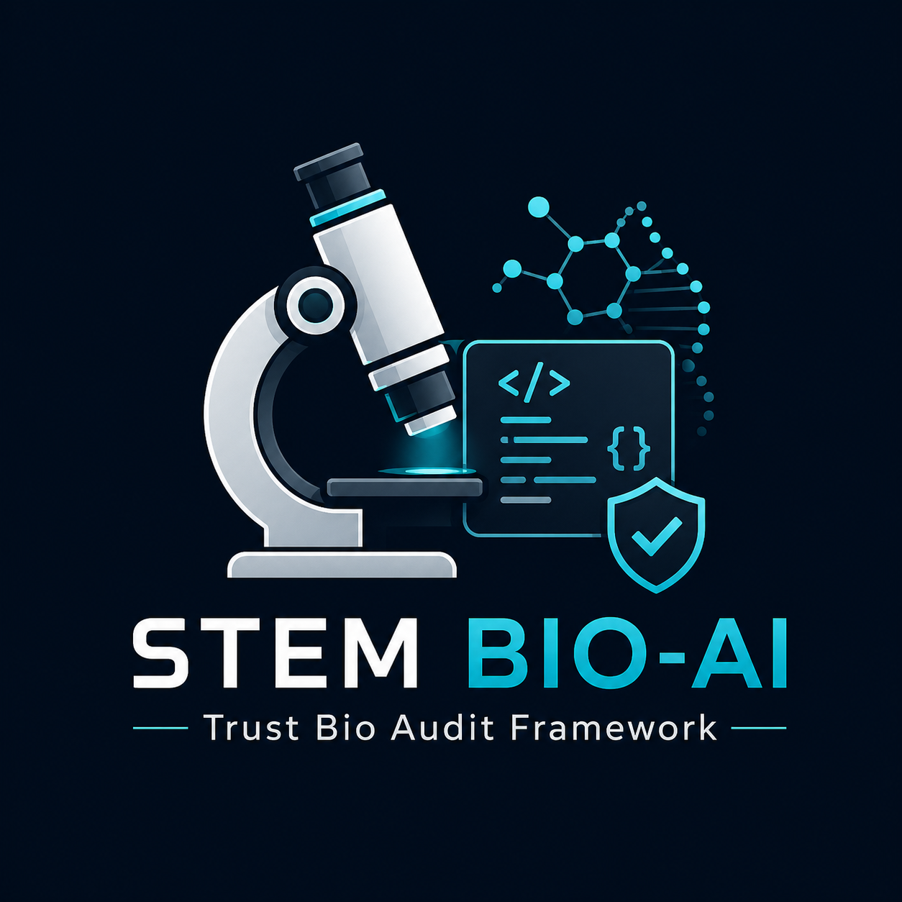
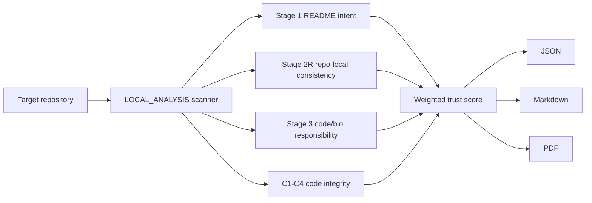

# STEM BIO-AI

<p align="center">
  
</p>

**Trust Audit Framework for Bio/Medical AI Repositories**

[](https://github.com/flamehaven01/STEM-BIO-AI/actions/workflows/python-package.yml)
[](https://github.com/flamehaven01/STEM-BIO-AI/actions/workflows/validate-skill.yml)
[](pyproject.toml)
[](LICENSE)
[](CHANGELOG.md)
[](https://huggingface.co/spaces/Flamehaven/stem-bio-ai)

Bio/medical AI repositories can look credible at the README layer while leaving trust gaps in code, CI, dependency hygiene, or clinical-use boundaries. STEM BIO-AI evaluates the visible repository surface with a deterministic local scanner.

> Does this repository expose enough trust evidence to be considered, contained, or rejected?

## Core Features

- **No API key required** - no OpenAI, Anthropic, or GitHub API key is needed.
- **No model-runtime dependency** - no PyTorch, TensorFlow, CUDA, or GPU requirement for the scanner.
- **Tier meaning built in** - maps evidence to T0-T4 trust tiers, from `T0 Trust Not Established` to `T4 Strong Observable Trust`.
- **CLI artifacts** - `stem <folder> --level 3 --format all` emits JSON, Markdown, and PDF review outputs.

## Boundary

STEM BIO-AI is not a clinical certifier, regulatory clearance tool, medical recommendation engine, or scientific efficacy validator. It is a repository trust pre-screen for observable evidence.

Public demo usage should be limited to public repositories. Private or proprietary repositories should be audited locally.

## Quick Start

```bash
git clone https://github.com/flamehaven01/STEM-BIO-AI.git
cd STEM-BIO-AI
pip install -e .[pdf]

stem /path/to/bio-ai-repo --level 1 --format all  # 1-page brief
stem /path/to/bio-ai-repo --level 2 --format all  # 3-page stage analysis
stem /path/to/bio-ai-repo --level 3 --format all  # 5-page deep review
```

`stem <folder>` is shorthand for `stem audit <folder>`. GitHub URL auditing is not enabled in the local CLI; clone the target repository first, then point the CLI at the local path.

## Report Levels And Artifacts

Each run writes to `--out DIR` (default: `stem_output/`).

| Level | PDF | Best For | Outputs |
|---|---:|---|---|
| `--level 1` | 1 page | Executive dashboard | score, tier, stage cards, code integrity |
| `--level 2` | 3 pages | Standard audit review | Level 1 + Stage 1/2R breakdown, Stage 3 T/B-series, gap analysis |
| `--level 3` | 5 pages | Full local evidence packet | Level 2 + code integrity deep dive, classification analysis, remediation roadmap |

```text
<repo>_experiment_results.json   # machine-readable score + evidence object
<repo>_report.md                 # human-readable audit report
<repo>_brief_1p.pdf              # Level 1 executive dashboard
<repo>_detailed_3p.pdf           # Level 2 stage analysis
<repo>_detailed_5p.pdf           # Level 3 deep review packet
```

## Scoring Model

| Stage | Weight | What It Evaluates |
|---|---:|---|
| Stage 1: README Intent | 40% | Scope clarity, hype control, clinical boundary language |
| Stage 2R: Repo-Local Consistency | 20% | README/docs/package/workflow/test alignment |
| Stage 3: Code / Bio Responsibility | 40% | CI, tests, changelog hygiene, data provenance |
| C1-C4: Code Integrity | Advisory / penalty | Credentials, dependency pinning, deprecated paths, fail-open exceptions |

| Tier | Score | Disposition |
|---|---:|---|
| T0 | 0-39 | Trust not established |
| T1 | 40-54 | Quarantine |
| T2 | 55-69 | Caution |
| T3 | 70-84 | Supervised consideration |
| T4 | 85-100 | Strong observable trust |

`Final = (S1 x 0.40) + (S2R x 0.20) + (S3 x 0.40) - Risk Penalty`

## Web Demo

Live: [huggingface.co/spaces/Flamehaven/stem-bio-ai](https://huggingface.co/spaces/Flamehaven/stem-bio-ai)

Run locally:

```bash
pip install -e .[demo]
python app.py
```

The Space clones a public GitHub repository and runs the same deterministic local scanner. It does not call OpenAI, Anthropic, or the GitHub API.

## Architecture



Core files: `stem_ai/scanner.py`, `stem_ai/render.py`, `stem_ai/cli.py`, and `stem_ai/app.py`.

## Agent Skill Install

```bash
# Generic
git clone --depth 1 https://github.com/flamehaven01/STEM-BIO-AI.git ~/.agents/skills/stem-bio-ai

# Claude Code
git clone --depth 1 https://github.com/flamehaven01/STEM-BIO-AI.git ~/.claude/skills/stem-bio-ai
```

## Repository Structure

```text
STEM-BIO-AI/
  app.py                   # HuggingFace Spaces / Gradio entry point
  pyproject.toml           # Package metadata and extras
  requirements.txt         # Spaces dependency list
  SKILL.md                 # Universal agent skill definition
  CHANGELOG.md             # Version history
  stem_ai/                 # Core Python package
  audits/                  # Reference artifact sets
  spec/                    # Core protocol specifications
  memory/                  # MICA contract artifacts
  .github/workflows/       # CI checks
```

## Contributing

See [CONTRIBUTING.md](CONTRIBUTING.md). High-value areas: rubric discrimination examples, clinical-adjacency trigger refinements, report rendering improvements.

## License

Apache 2.0. See [LICENSE](LICENSE).

## Author

Maintained by Flamehaven - [flamehaven01](https://github.com/flamehaven01)

## Citation

```bibtex
@software{stem-bio-ai,
  author  = {Yun, Kwansub},
  title   = {STEM BIO-AI: Trust Audit Framework for Bio/Medical AI Repositories},
  version = {1.1.2},
  year    = {2026},
  url     = {https://github.com/flamehaven01/STEM-BIO-AI}
}
```
