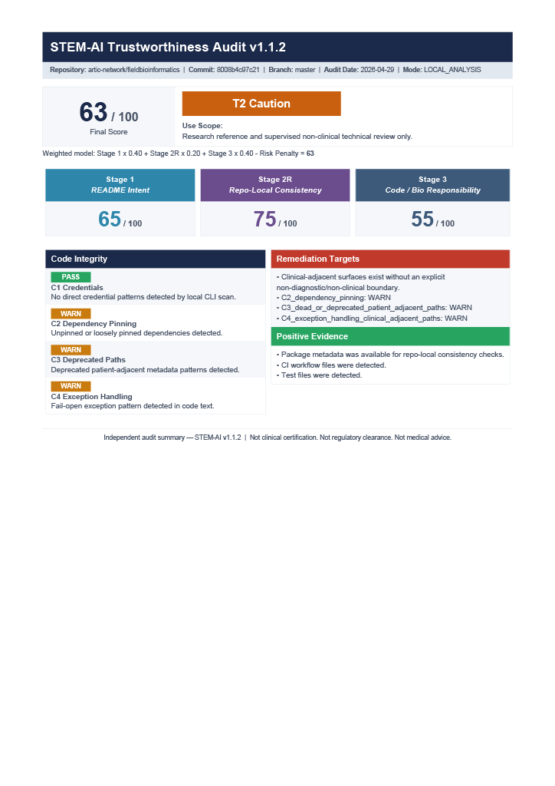
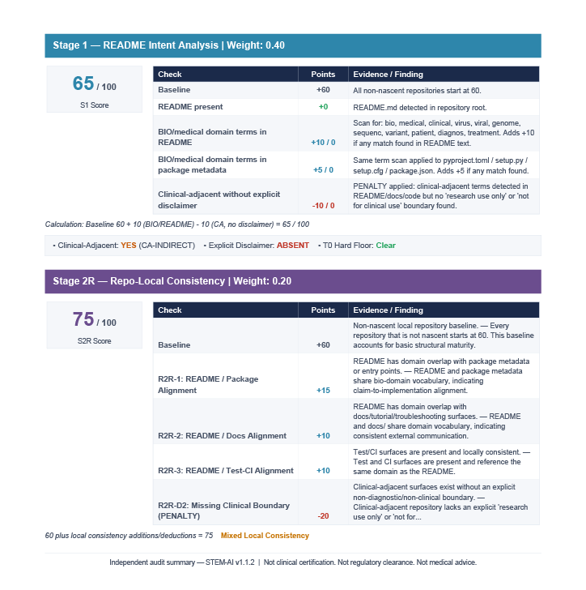
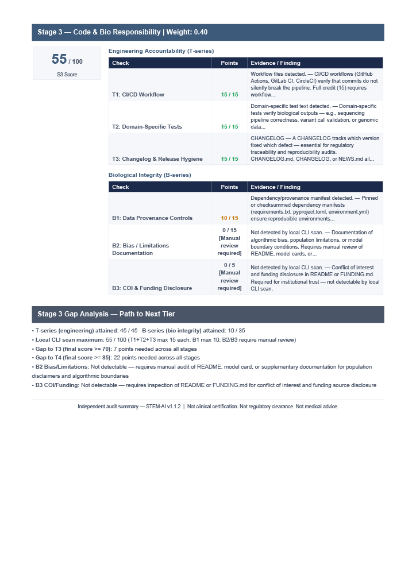
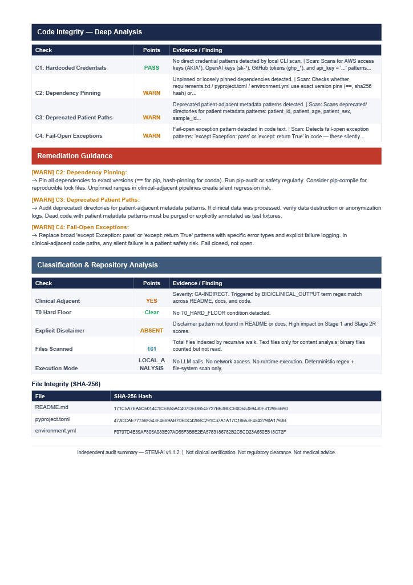
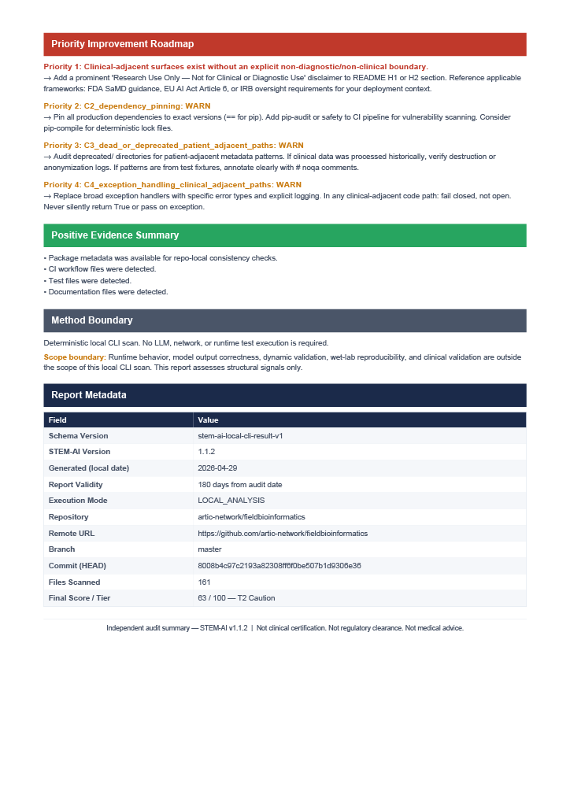
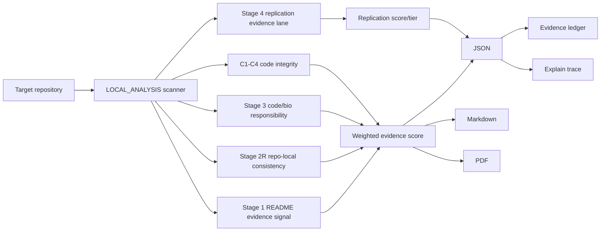

# STEM BIO-AI

<p align="center">
  
</p>

**Deterministic Evidence-Surface Scanner for Bio/Medical AI Repositories**

[](https://github.com/flamehaven01/STEM-BIO-AI/actions/workflows/python-package.yml)
[](https://github.com/flamehaven01/STEM-BIO-AI/actions/workflows/validate-skill.yml)
[](pyproject.toml)
[](LICENSE)
[](CHANGELOG.md)
[](https://huggingface.co/spaces/Flamehaven/stem-bio-ai)

Bio/medical AI repositories can look credible at the README layer while leaving gaps in code, CI, dependency hygiene, replication evidence, or clinical-use boundaries. STEM BIO-AI scans the visible repository surface for observable evidence signals using local file reads, deterministic pattern matching, and stdlib AST parsing — no LLM, no API, no runtime execution.

> Does this repository expose enough observable evidence to be considered, contained, or rejected as a starting point?

## Core Features

- **No API key required** — no OpenAI, Anthropic, or GitHub API key is needed.
- **No model-runtime dependency** — no PyTorch, TensorFlow, CUDA, or GPU requirement.
- **Triage tier built in** — maps evidence signals to T0–T4 review-priority tiers.
- **Replication evidence lane** — reports Stage 4 `replication_score` / `replication_tier` separately from the final score.
- **Explainable evidence ledger** — `--explain` writes file/line/snippet evidence with stable `finding_id` values.
- **Reasoning diagnostics** — reports confidence envelope, lane coherence, uncertainty, and evidence-risk signals without changing the final score.
- **AI advisory contract** — `--advisory validate` adds offline provider-neutral advisory validation; `--advisory packet` exports a sanitized provider-budgeted AI handoff packet with exact `allowed_finding_ids`; `--advisory-response FILE` validates provider-produced JSON against the same citation contract with no AI API call.
- **Provider benchmark artifacts** — `scripts/provider_packet_benchmark.py` exports local benchmark packet stats and optional response-validation records without making provider API calls.
- **License restriction evidence** — Stage 4 records non-commercial, research-only, academic-only, no-clinical-use, and related license/use-scope boundaries as review evidence without changing the final score.
- **CLI artifacts** — `stem <folder> --level 3 --format all` emits JSON, Markdown, and PDF outputs.

## Measurement Boundary

STEM BIO-AI scans observable repository signals using file reads, directory structure checks, regex pattern matching, and Python AST structure checks. It does not infer model accuracy, clinical safety, author intent, scientific validity, or regulatory compliance.

It is a pre-screening triage tool, not a certification or trust verdict. A T4 score means strong observable evidence signals — it does not mean the repository is safe for clinical deployment.

Public demo usage should be limited to public repositories. Private or proprietary repositories should be audited locally.

## Quick Start

```bash
git clone https://github.com/flamehaven01/STEM-BIO-AI.git
cd STEM-BIO-AI
pip install -e .[pdf]

stem /path/to/bio-ai-repo --level 1 --format all  # 1-page brief
stem /path/to/bio-ai-repo --level 2 --format all  # 3-page stage analysis
stem /path/to/bio-ai-repo --level 3 --format all  # 5-page deep review
stem /path/to/bio-ai-repo --level 3 --format all --explain
stem /path/to/bio-ai-repo --advisory validate
stem /path/to/bio-ai-repo --advisory packet
stem /path/to/bio-ai-repo --advisory-response provider_advisory.json
```

`stem <folder>` is shorthand for `stem audit <folder>`. GitHub URL auditing is not enabled in the local CLI; clone the target repository first, then point the CLI at the local path.

## Report Levels And Artifacts

Each run writes to `--out DIR` (default: `stem_output/`).

| Level | PDF | Best For | Outputs |
|---|---:|---|---|
| `--level 1` | 1 page | Executive dashboard | score, tier, stage cards, code integrity |
| `--level 2` | 3 pages | Standard audit review | Level 1 + Stage 1/2R breakdown, Stage 3 T/B-series, gap analysis |
| `--level 3` | 5 pages | Full local evidence packet | Level 2 + code integrity deep dive, classification analysis, remediation roadmap |

```text
<repo>_experiment_results.json   # machine-readable score + evidence object
<repo>_report.md                 # human-readable audit report
<repo>_brief_1p.pdf              # Level 1 executive dashboard
<repo>_detailed_3p.pdf           # Level 2 stage analysis
<repo>_detailed_5p.pdf           # Level 3 deep review packet
<repo>_explain.txt               # optional --explain proof trace
```

## Scoring Model

| Stage | Weight | Signal Measured |
|---|---:|---|
| Stage 1: README Evidence | 40% | Bio-domain vocabulary; hype penalties; limitation, regulatory, disclaimer, demographic-bias, and reproducibility responsibility signals |
| Stage 2R: Repo-Local Consistency | 20% | Vocabulary overlap across README, docs, package metadata, CI, tests, plus limitation repetition and contradiction/staleness/workflow-support checks |
| Stage 3: Code / Bio Responsibility | 40% | CI presence; test domain coverage; changelog; dependency manifest; bias/COI language |
| Stage 4: Replication Evidence | Separate lane | Containers; reproducibility targets; lock/pin/hash evidence; dataset/model references; citation/CLI/seed/example signals; license/use-scope restriction evidence |
| C1-C4: Code Integrity | Advisory / penalty | Hardcoded secrets; dependency pinning; deprecated patient paths; fail-open exceptions |

`Final = (S1 × 0.40) + (S2R × 0.20) + (S3 × 0.40) − Risk Penalty`

Clinical-adjacent repositories without an explicit disclaimer are capped at T2 (score ≤ 69). Repositories with unbounded CA-DIRECT claims are capped at T0 (score ≤ 39).

Stage 4 is intentionally not folded into the final score in v1.3. It is reported as `replication_score` and `replication_tier` so reviewers can inspect replication evidence without changing the established T0-T4 scoring formula before benchmark calibration.

`reasoning_model` diagnostics are also separate from the final score. They summarize evidence budget, confidence envelope, lane coherence, uncertainty, and evidence-risk gate signals using deterministic stdlib-only formulas. These values are diagnostic initial priors, not a replacement score or clinical truth claim.

`ai_advisory` is optional and omitted by default. `--advisory validate` runs an offline contract validator only; `--advisory packet` writes a sanitized `{stem}_advisory_input.json` for future adapters. The packet is provider-budgeted by default, capped to 40 evidence findings, and includes `allowed_finding_ids` plus a prompt contract requiring exact citation copying. `--advisory-response FILE` validates a provider-produced JSON advisory response against the current audit's evidence ledger without calling any provider. No Gemini, OpenAI, Claude, Kimi, Qwen, Ollama, or local model call is made by the core scanner. The contract reserves provider-neutral space for future adapters and rejects advisory output that lacks valid `finding_id` citations, attempts to override scores, or makes uncited clinical/regulatory claims.

Python integration surfaces are documented in `docs/API_CONTRACT.md` (stable, v1.5.5).

## Triage Tiers

| Tier | Score | Review Priority |
|---|---:|---|
| T0 | 0–39 | Insufficient evidence — do not proceed without independent expert review |
| T1 | 40–54 | Minimal evidence signal — expert validation required before any use |
| T2 | 55–69 | Partial evidence — supervised non-clinical research reference only |
| T3 | 70–84 | Adequate evidence signal — supervised institutional review candidate |
| T4 | 85–100 | Strong evidence signal — clinical deployment still requires independent validation |

## What STEM Actually Measures

Scores reflect observable repository signals only. Each item below describes what is physically detected — not semantic intent or clinical safety.

| Score Component | Actual Detection Method |
|---|---|
| Stage 1 baseline | Non-zero README present (+60 base) |
| Stage 1 domain signal | Bio-domain keyword regex match in README and package metadata |
| Stage 1 hype/responsibility | H1-H6 hype-claim regex penalties plus R1-R5 responsibility evidence for limitations, regulatory framing, clinical boundary, demographic bias, and reproducibility |
| Stage 1 boundary | Disclaimer phrase match (`not for clinical`, `research use only`, etc.) |
| Stage 2R consistency | Set intersection of bio-domain vocabulary across README, docs, package, tests; repeated limitation language across surfaces; penalties for internal clinical-boundary contradictions, stale README/package versions, and unsupported workflow/test/CLI claims |
| T1 CI/CD | `.github/workflows/` directory contains at least one file |
| T2 Domain Tests | `tests/` directory text contains bio-domain vocabulary (regex) |
| T3 Changelog | `CHANGELOG.md`, `CHANGELOG`, or `NEWS.md` file exists |
| B1 Data Provenance | `requirements.txt`, `pyproject.toml`, or `environment.yml` file exists |
| B2 Bias/Limitations | `bias`, `limitation`, `not validated`, `validation cohort` in README or docs (regex) |
| B3 COI/Funding | `funding`, `grant`, `sponsor`, `conflict of interest` in README, docs, or FUNDING.md (regex) |
| Stage 4 License Restriction | `non-commercial`, `research use only`, `academic use only`, `not for clinical use`, and related license/use-scope restrictions in LICENSE/README/docs metadata |
| Stage 4 Containers | `Dockerfile` or compose file exists |
| Stage 4 Reproduction Target | `Makefile` target such as `reproduce`, `eval`, `benchmark`, or `test` |
| Stage 4 Dependency Lock/Pin | environment/lock/requirements file presence; exact pins or hash evidence |
| Stage 4 Reproducibility Section | README heading mentioning reproduction, replication, rerun, or result recreation |
| Stage 4 Artifact References | dataset/model/checkpoint URLs or checksum files |
| Stage 4 Citation/Interface | `CITATION.cff`, package CLI entry points, argparse AST evidence |
| AST Summary | Python stdlib `ast` detects assertion tests, seed settings, argparse, annotations, docstrings, portable model loading, and fail-open handlers |
| CA Severity | Clinical/diagnostic phrase regex match in README, docs, and package metadata |
| C1 Credentials | Hardcoded key patterns: AWS `AKIA*`, OpenAI `sk-*`, GitHub `ghp_*`, `api_key=...`; obvious placeholder/test values are recorded but excluded from the C1 penalty |
| C2 Dependency Pinning | `==` or hash pin present vs. loose ranges `>=`, `~=`, `<`, `>` |
| C3 Deprecated Paths | Patient metadata patterns in `deprecated/`, `legacy/`, `archive/` directories |
| C4 Fail-Open | `except Exception: pass` or `except: pass` pattern in Python source |

## Web Demo

Live: [huggingface.co/spaces/Flamehaven/stem-bio-ai](https://huggingface.co/spaces/Flamehaven/stem-bio-ai)

Run locally:

```bash
pip install -e .[demo]
python app.py
```

The Space clones a public GitHub repository and runs the same deterministic local scanner. It does not call OpenAI, Anthropic, or the GitHub API.

## Report Preview

The local CLI can produce a 5-page PDF packet for an audited repository. The preview below shows the `--level 3` detailed report format.

**PDF:** [Download the 5-page sample report](docs/assets/report-preview/fieldbioinformatics/artic-network_fieldbioinformatics_detailed_5p.pdf)

<p align="center">
  
</p>

<details>
<summary>View all 5 preview pages</summary>

| Page 1 | Page 2 |
|---|---|
|  |  |

| Page 3 | Page 4 |
|---|---|
|  |  |

| Page 5 |
|---|
|  |

</details>

## Architecture



Core files: `stem_ai/scanner.py`, `stem_ai/render.py`, `stem_ai/cli.py`, `stem_ai/detectors.py`, `stem_ai/detector_surface.py`, `stem_ai/detector_ast.py`, `stem_ai/detector_stage4.py`, `stem_ai/evidence.py`, and `stem_ai/app.py`.

## Agent Skill Install

```bash
# Generic
git clone --depth 1 https://github.com/flamehaven01/STEM-BIO-AI.git ~/.agents/skills/stem-bio-ai

# Claude Code
git clone --depth 1 https://github.com/flamehaven01/STEM-BIO-AI.git ~/.claude/skills/stem-bio-ai
```

## Repository Structure

```text
STEM-BIO-AI/
  app.py                   # HuggingFace Spaces / Gradio entry point
  pyproject.toml           # Package metadata and extras
  requirements.txt         # Spaces dependency list
  SKILL.md                 # Universal agent skill definition
  CHANGELOG.md             # Version history
  stem_ai/                 # Core Python package
  audits/                  # Reference artifact sets
  memory/                  # MICA contract artifacts
  .github/workflows/       # CI checks
```

## Contributing

See [CONTRIBUTING.md](CONTRIBUTING.md). High-value areas: rubric discrimination examples, clinical-adjacency trigger refinements, report rendering improvements.

## License

Apache 2.0. See [LICENSE](LICENSE).

## Author

Maintained by Flamehaven - [flamehaven01](https://github.com/flamehaven01)

## Citation

```bibtex
@software{stem-bio-ai,
  author  = {Yun, Kwansub},
  title   = {STEM BIO-AI: Deterministic Evidence-Surface Scanner for Bio/Medical AI Repositories},
  version = {1.5.3},
  year    = {2026},
  url     = {https://github.com/flamehaven01/STEM-BIO-AI}
}
```
