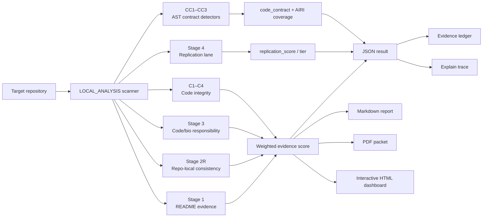
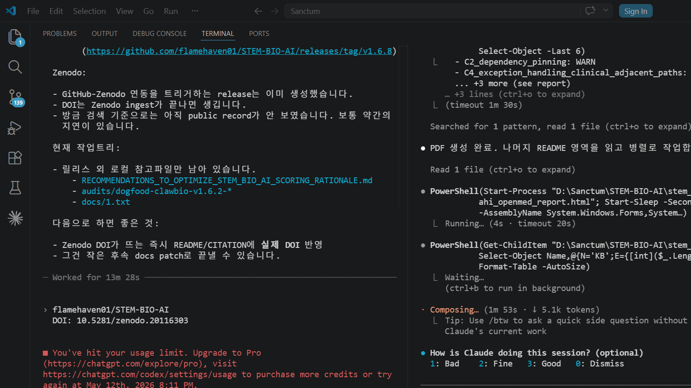

# STEM BIO-AI

<p align="center">
  
</p>

<p align="center">
  <b>Deterministic evidence-surface scanner for bio/medical AI repositories.</b><br>
  No LLM. No API key. No model runtime. No secrets sent anywhere.
</p>

<p align="center">
  <a href="https://github.com/flamehaven01/STEM-BIO-AI/actions/workflows/python-package.yml"></a>
  <a href="CHANGELOG.md"></a>
  <a href="pyproject.toml"></a>
  <a href="https://pypi.org/project/stem-ai/"></a>
  <a href="LICENSE"></a>
  <a href="https://huggingface.co/spaces/Flamehaven/stem-bio-ai"></a>
  <a href="https://doi.org/10.5281/zenodo.20154479"></a>
</p>

---

## Why STEM BIO-AI

Bio and medical AI repositories vary enormously in evidence quality — from rigorous academic tools to marketing-grade demos that carry clinical language with no data provenance, no reproducibility path, and no clinical-use disclaimer. Manual review is slow and inconsistent.

STEM BIO-AI scans the **observable repository surface** — README, docs, code structure, CI configuration, dependency manifests, changelogs — and maps detected signals to a structured evidence tier (T0–T4). The scan runs in seconds on a local clone, produces machine-readable JSON and PDF reports, and makes every scoring decision traceable to a specific file, line, and pattern.

> A T4 score means strong observable evidence signals. It does not mean the repository is safe for clinical deployment — that requires independent expert validation.

---

## Quick Start

```bash
git clone https://github.com/flamehaven01/STEM-BIO-AI.git
cd STEM-BIO-AI
pip install stem-ai
```

```bash
# editable local install with PDF output support
pip install -e .[pdf]

# fastest path: scan a local repository
stem /path/to/bio-ai-repo

# 5-page full evidence packet with proof trace
stem scan /path/to/bio-ai-repo --level 3 --format all --explain
```

```bash
# workflow-oriented CLI
stem scan /path/to/bio-ai-repo --level 2
stem scan /path/to/bio-ai-repo --policy strict_clinical_adjacency
stem gate /path/to/bio-ai-repo --min-tier T2
stem policy list
stem policy explain strict_clinical_adjacency
stem policy derive --clinical-strictness 4 --code-integrity-priority 3 --reproducibility-priority 2 --structured-limitations-requirement 3
stem policy simulate /path/to/bio-ai-repo --clinical-strictness 4 --code-integrity-priority 3 --reproducibility-priority 2 --structured-limitations-requirement 3
stem policy simulate /path/to/bio-ai-repo --profile-file policy/drafts/scoring_profile.reproducibility_first.v1.json
stem advisory validate /path/to/bio-ai-repo
stem advisory packet /path/to/bio-ai-repo --output advisory_out
stem advisory check-response /path/to/bio-ai-repo --response provider_advisory.json
```

```bash
# backward-compatible shortcuts still work
stem /path/to/bio-ai-repo --level 3 --format all --explain
stem audit /path/to/bio-ai-repo --tier-gate T3 --quiet
```

Clone the target repository first; the CLI operates on local paths only.

Calibration profiles are implemented in `mirror_only` mode in `1.7.4`. `--policy` changes what profile is surfaced in artifacts, while `policy derive` and `policy simulate` provide governed preview lanes without mutating the authoritative deterministic score path. `policy simulate --profile-file <path>` allows local schema-valid profile experiments without registering a new named policy. In the current rule scope, `strict_clinical_adjacency` is the only release-grade named recommendation; stronger reproducibility postures still fall back to `preview_only` simulation deltas rather than a named profile.

Researchers and domain specialists are expected to influence calibration through `derive`, `simulate`, and documented preview/profile proposals. The intent interview uses a governed `1–5` posture scale, while official score-affecting policy changes still require profile promotion rather than direct ad hoc tuning.

Full CLI reference: [`docs/CLI_REFERENCE.md`](docs/CLI_REFERENCE.md)

**Proof surfaces**
- Demo: [Hugging Face Space](https://huggingface.co/spaces/Flamehaven/stem-bio-ai)
- API contract: [`docs/API_CONTRACT.md`](docs/API_CONTRACT.md)
- Secret handling: [`docs/ADVISORY_SECRET_HANDLING.md`](docs/ADVISORY_SECRET_HANDLING.md)
- Advisory runtime boundary: [`docs/ADVISORY_RUNTIME.md`](docs/ADVISORY_RUNTIME.md)
- Example audits: [`docs/EXAMPLE_AUDITS.md`](docs/EXAMPLE_AUDITS.md)
- Scoring rationale: [`docs/SCORING_RATIONALE.md`](docs/SCORING_RATIONALE.md)
- Calibration profile architecture: [`docs/CALIBRATION_PROFILE_DESIGN.md`](docs/CALIBRATION_PROFILE_DESIGN.md)
- AIRI data governance: [`docs/AIRI_DATA_GOVERNANCE.md`](docs/AIRI_DATA_GOVERNANCE.md)
- Third-party data attribution: [`docs/THIRD_PARTY_DATA.md`](docs/THIRD_PARTY_DATA.md)
- Deterministic diagnostics: [`docs/DETERMINISTIC_DIAGNOSTICS.md`](docs/DETERMINISTIC_DIAGNOSTICS.md)
- Regulatory traceability mapping: [`docs/REGULATORY_MAPPING.md`](docs/REGULATORY_MAPPING.md)
- Regulatory basis registry: [`docs/regulatory_basis_registry.v1.json`](docs/regulatory_basis_registry.v1.json)
- CLI reference: [`docs/CLI_REFERENCE.md`](docs/CLI_REFERENCE.md)


---

## Triage Tiers

| Tier | Score | Recommended Action |
|------|------:|-------------------|
| **T0 Rejected** | 0 – 39 | Insufficient evidence — do not rely on without independent expert validation |
| **T1 Quarantine** | 40 – 54 | Exploratory review only — expert validation required before any use |
| **T2 Caution** | 55 – 69 | Research reference and supervised non-clinical technical review only |
| **T3 Supervised** | 70 – 84 | Supervised institutional review candidate |
| **T4 Candidate** | 85 – 100 | Strong evidence posture — clinical deployment still requires independent validation |

Clinical-adjacent repositories without an explicit disclaimer are **hard-capped at T2** (score ≤ 69).
Repositories with unbounded CA-DIRECT claims are **hard-capped at T0** (score ≤ 39).

Tier boundary derivation and calibration gap disclosures: [`docs/SCORING_RATIONALE.md`](docs/SCORING_RATIONALE.md).

---

## Scoring Model

```
Final = (Stage 1 × 0.40) + (Stage 2R × 0.20) + (Stage 3 × 0.40) − C1 Penalty
```

| Stage | Weight | What Is Measured |
|-------|-------:|-----------------|
| **Stage 1** README Evidence | 40% | Bio-domain vocabulary; H1–H6 hype-claim penalties; R1–R5 responsibility signals (limitations, regulatory framing, clinical disclaimer, demographic-bias, reproducibility) |
| **Stage 2R** Repo-Local Consistency | 20% | Vocabulary overlap across README, docs, package metadata, CI, and tests; limitation repetition; contradiction, staleness, and unsupported-workflow deductions |
| **Stage 3** Code/Bio Responsibility | 40% | CI presence; domain test coverage; changelog hygiene (T3); data provenance and IRB/dataset citation (B1); bias/limitation measurement evidence (B2); conflict-of-interest disclosure (B3) |
| **Stage 4** Replication Evidence | Separate lane | Containers; reproducibility targets; dependency locks/pins; dataset and model artifact references; seed, CLI, and citation signals; license/use-scope restrictions |
| **C1–C4** Code Integrity | Penalty / advisory | Hardcoded credentials (C1, −10 pts); dependency pinning (C2); deprecated patient-adjacent paths (C3); fail-open exception handlers (C4) |

Stage 4 is reported as `replication_score` / `replication_tier` and does **not** affect `score.final_score`. Full scoring rationale and calibration gap disclosures are in [`docs/SCORING_RATIONALE.md`](docs/SCORING_RATIONALE.md).

---

## Architecture



Core modules: `stem_ai/scanner.py`, `stem_ai/render.py`, `stem_ai/cli.py`, `stem_ai/detectors.py`, `stem_ai/detector_surface.py`, `stem_ai/detector_ast.py`, `stem_ai/detector_bio.py`, `stem_ai/detector_contract.py`, `stem_ai/detector_stage4.py`, `stem_ai/evidence.py`, `stem_ai/airi_risk_mapping.py`, `stem_ai/app.py`

---

## Output Artifacts

Each run writes to `--out DIR` (default: `stem_output/`).

| Level | Pages | Audience | Artifacts |
|-------|------:|---------|-----------|
| `--level 1` | 1 | Executive / triage | Score, tier, stage cards, code integrity summary |
| `--level 2` | 3 | Standard audit review | Level 1 + Stage 1/2R/3 breakdown, gap analysis |
| `--level 3` | 5 | Full evidence packet | Level 2 + code integrity deep dive, classification analysis, remediation roadmap |

```
<repo>_experiment_results.json   # machine-readable score + full evidence object
<repo>_report.html               # interactive 5-section HTML dashboard (v1.7.0+)
<repo>_report.md                 # human-readable audit report
<repo>_brief_1p.pdf              # Level 1 executive dashboard
<repo>_detailed_3p.pdf           # Level 2 stage analysis
<repo>_detailed_5p.pdf           # Level 3 deep review packet
<repo>_explain.txt               # --explain: file/line/snippet proof trace
```

---

## HTML Report Dashboard

`--format html` generates a self-contained interactive dashboard (v1.7.0+). Single `.html` file — no network, no external dependencies.

<p align="center">
  
</p>

**5 sections:** Executive Summary · Score Matrix · Code Integrity (expandable cards) · AIRI Risk Coverage (toggle) · Evidence Detail (filter chips)

Interactive features: sticky scroll-spy nav · `?` tooltip icons on every metric · click-to-expand evidence cards · covered/gaps toggle for AIRI risks · FAIL/WARN/PASS/INFO filter on the evidence ledger.

The AIRI section now distinguishes between the **full local AIRI registry**, the **curated runtime bundle** used by deterministic scans, and the **detector mapping registry** that connects STEM BIO-AI findings to AIRI risk IDs. Upstream AIRI provenance is surfaced in runtime artifacts, not only in README/docs.

---

## Report Preview

<p align="center">
  
</p>

**Sample PDF:** [Download the 5-page Level 3 report](docs/assets/report-preview/fieldbioinformatics/artic-network_fieldbioinformatics_detailed_5p.pdf)

<details>
<summary>View all 5 preview pages</summary>

| Page 1 | Page 2 |
|--------|--------|
|  |  |

| Page 3 | Page 4 |
|--------|--------|
|  |  |

| Page 5 |
|--------|
|  |

</details>

---

## Detection Methods

Every scored item maps to a concrete, inspectable detection method. No inference, no LLM judgment.

<details>
<summary>Full detection table</summary>

| Component | Detection Method |
|-----------|-----------------|
| Stage 1 baseline | Non-zero README present (+60 base) |
| Stage 1 domain signal | Bio-domain keyword regex in README and package metadata |
| Stage 1 hype penalties (H1–H6) | Regex: clinical certainty, regulatory approval, autonomous replacement, breakthrough marketing, universal generalization, perfect accuracy claims |
| Stage 1 responsibility signals (R1–R5) | Regex: limitations section, regulatory framework, clinical disclaimer (CA-severity-weighted), demographic-bias disclosure, reproducibility provisions |
| Stage 2R consistency | Vocabulary set intersection across README/docs/package/tests; limitation repetition; clinical-boundary contradiction, version-staleness, and workflow-support deductions |
| Stage 3 T1 CI | `.github/workflows/` contains at least one file |
| Stage 3 T2 domain tests | `tests/` directory text contains bio-domain vocabulary (regex) |
| Stage 3 T3 changelog | CHANGELOG file presence + bug-fix/patch/security entry detection (3-tier: 0/+5/+15) |
| Stage 3 B1 data provenance | Dependency manifest presence + IRB/dataset-citation language detection (3-tier: 0/+10/+15) |
| Stage 3 B2 bias measurement | Bias/limitations vocabulary + quantitative measurement evidence (subgroup analysis, AUROC, demographic parity) (3-tier: 0/+8/+15) |
| Stage 3 B3 COI/funding | Funding, grant, sponsor, conflict-of-interest language in README/docs/FUNDING.md |
| Stage 4 containers | Dockerfile or compose file present |
| Stage 4 reproducibility target | Makefile with reproduce/eval/benchmark/test targets |
| Stage 4 dependency lock | Environment/lock/requirements file; exact pins or hash evidence |
| Stage 4 artifact references | Dataset/model/checkpoint URLs or checksum files |
| Stage 4 citation/interface | CITATION.cff; argparse CLI entry points (AST) |
| Stage 4 license restriction | Non-commercial, research-only, academic-only, no-clinical-use restrictions in LICENSE/README |
| CA severity | Clinical/diagnostic phrase regex in README, docs, and package metadata |
| C1 credentials | AWS `AKIA*`, OpenAI `sk-*`, GitHub `ghp_*`, `api_key=...` patterns; obvious placeholders excluded from penalty |
| C2 dependency pinning | `==` or hash pin vs. loose `>=`, `~=`, `<`, `>` ranges |
| C3 deprecated paths | Patient-metadata patterns in `deprecated/`, `legacy/`, `archive/` directories |
| C4 fail-open | `except Exception: pass` or `except: pass` in Python source (AST) |
| **CC1** clinical zero default | AST scan of function defaults: keyword-only and positional params named `confidence_threshold`, `score_threshold`, `min_confidence`, etc. defaulted to `0.0` |
| **CC2** API contract | README-declared names cross-checked against `__all__` exports; phantom APIs flagged |
| **CC3** shallow validator | `validate_*` / `check_*` functions using only `len()` (no regex structure check) flagged as insufficient for clinical/PII validation |

</details>

---

## AI Advisory Contract

The advisory system exports a sanitized, provider-neutral handoff packet and validates provider responses — without making any provider API call.

```bash
stem advisory validate /path/to/repo                # offline contract check
stem advisory packet /path/to/repo                  # export sanitized input packet
stem advisory check-response /path/to/repo --response FILE
```

**Non-negotiable rules (enforced by the validator):**
- Provider output cannot override `score.final_score` or `score.formal_tier`
- Every advisory item must cite exact `finding_id` strings from `allowed_finding_ids`
- Raw repository source text is not included in provider packets
- Responses containing clinical safety, efficacy, regulatory, or medical-advice claims are rejected
- `allowed_finding_ids` is capped at 40 entries per packet

**Packet hardening added in v1.5.7:**
- `provider_request` now carries a secret-free request schema plus deterministic argument-validation status
- `contract_schemas` exports the advisory input/output contract shapes for downstream validators
- `packet_contract` confirms allowlist parity, snippet omission, and non-negative omission counts before handoff

**Secret boundary hardening added in v1.5.9:**
- provider-specific environment variables are recognized before the generic advisory key fallback
- provider handoff metadata exports endpoint-policy validation and the expected env-var name, never the key value
- embedded-credential URLs are rejected; cloud providers require `https`; plain `http` is limited to localhost
- `.env` files are ignored by default; `.env.example` documents supported variable names only
- `--advisory call` is now the explicit provider-call boundary, with centralized redaction, logging-policy export, child-env allowlist reporting, and artifact pre-write sanitization

Full contract: [`docs/API_CONTRACT.md`](docs/API_CONTRACT.md)
Secret policy: [`docs/ADVISORY_SECRET_HANDLING.md`](docs/ADVISORY_SECRET_HANDLING.md)
Runtime boundary: [`docs/ADVISORY_RUNTIME.md`](docs/ADVISORY_RUNTIME.md)

---

## MICA Memory Layer

The repository keeps a versioned MICA memory layer under `memory/` for agent-session initialization,
drift control, and release provenance. Historical snapshots are retained as archive; the active layer
is selected by `memory/mica.yaml`.

Operational reference: [`docs/MICA_MEMORY.md`](docs/MICA_MEMORY.md)

---

## Web Demo

Live demo: [huggingface.co/spaces/Flamehaven/stem-bio-ai](https://huggingface.co/spaces/Flamehaven/stem-bio-ai)

<p align="center">
  
</p>

The Space runs the same deterministic local scanner on public GitHub repositories. No provider API call is made.

Run locally:

```bash
pip install -e .[demo]
python app.py
```

---

## Repository Structure

```
STEM-BIO-AI/
  stem_ai/              # Core Python package
  docs/                 # API contract, advisory runtime/secret policy, scoring rationale, MICA policy, report previews
  memory/               # Versioned MICA archive/playbook/lessons; active layer selected by mica.yaml
  audits/               # Reference benchmark artifacts
  scripts/              # Benchmark and validation scripts
  tests/                # Regression test suite
  app.py                # HuggingFace Spaces / Gradio entry point
  pyproject.toml        # Package metadata and extras
  SKILL.md              # Universal agent skill definition
  CHANGELOG.md          # Version history
```

---

## Agent Skill Install

```bash
# Claude Code
git clone --depth 1 https://github.com/flamehaven01/STEM-BIO-AI.git ~/.claude/skills/stem-bio-ai

# Generic agent frameworks
git clone --depth 1 https://github.com/flamehaven01/STEM-BIO-AI.git ~/.agents/skills/stem-bio-ai
```

---

## Contributing

See [CONTRIBUTING.md](CONTRIBUTING.md). High-value areas: rubric discrimination examples, clinical-adjacency trigger refinements, additional bio-domain benchmark repositories, report rendering improvements.

---

## Citation

Preferred citation metadata lives in [`CITATION.cff`](CITATION.cff).

Current DOI-backed archive for the latest Zenodo-published release (`v1.7.1`):
- <https://doi.org/10.5281/zenodo.20154479>

```bibtex
@software{stem-bio-ai,
  author  = {Yun, Kwansub},
  title   = {STEM BIO-AI: Deterministic Evidence-Surface Scanner for Bio/Medical AI Repositories},
  version = {1.7.1},
  year    = {2026},
  doi     = {10.5281/zenodo.20154479},
  url     = {https://doi.org/10.5281/zenodo.20154479}
}
```

---

## License

Apache 2.0. See [LICENSE](LICENSE).

Maintained by [flamehaven01](https://github.com/flamehaven01)


