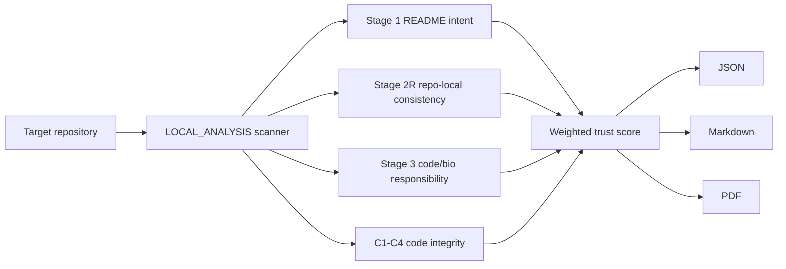

# STEM BIO-AI

**Trust Audit Framework for Bio/Medical AI Repositories**

[](https://github.com/flamehaven01/STEM-BIO-AI/actions/workflows/python-package.yml)
[](https://github.com/flamehaven01/STEM-BIO-AI/actions/workflows/validate-skill.yml)
[](pyproject.toml)
[](LICENSE)
[](CHANGELOG.md)
[](https://huggingface.co/spaces/Flamehaven/stem-bio-ai)

STEM BIO-AI is a deterministic trust-audit framework for open-source bio/medical AI repositories. It inspects repository artifacts, scores observable governance evidence, and emits JSON, Markdown, and PDF review packets — without an LLM key or network call.

It is not a clinical certifier, regulatory clearance tool, or scientific efficacy validator. It answers one narrower question:

> Does this repository expose enough trust evidence to be considered, contained, or rejected?

```bash
stem <folder>            # Level 1 — 1-page executive brief (default)
stem <folder> --level 2  # Level 2 — 3-page stage analysis
stem <folder> --level 3  # Level 3 — 5-page deep review + remediation roadmap
```

---

## Table of Contents

- [About](#about)
- [Quick Start](#quick-start)
- [Installation](#installation)
- [CLI Usage](#cli-usage)
- [Output Artifacts](#output-artifacts)
- [Web Demo](#web-demo)
- [Architecture](#architecture)
- [Scoring Model](#scoring-model)
- [Repository Structure](#repository-structure)
- [Security and Boundaries](#security-and-boundaries)
- [Roadmap](#roadmap)
- [Contributing](#contributing)
- [License](#license)
- [Citation](#citation)

---

## About

Bio/medical AI repositories often look credible at the README layer while leaving trust gaps in code, CI, dependency hygiene, or clinical-use boundaries. STEM BIO-AI evaluates the visible repository surface instead of relying on marketing claims.

The framework separates two jobs:

- **Fact extraction** — inspect README, docs, package metadata, tests, CI, dependency files, and code paths.
- **Trust classification** — score whether observable evidence supports supervised use, quarantine, or rejection.

---

## Quick Start

```bash
git clone https://github.com/flamehaven01/STEM-BIO-AI.git
cd STEM-BIO-AI
pip install -e .[pdf]

stem /path/to/bio-ai-repo               # Level 1 brief
stem /path/to/bio-ai-repo --level 3     # Level 3 full packet
```

---

## Installation

### CLI with PDF support

```bash
pip install -e .[pdf]
```

### As an agent skill

```bash
# Generic path
git clone --depth 1 https://github.com/flamehaven01/STEM-BIO-AI.git ~/.agents/skills/stem-bio-ai

# Claude Code
git clone --depth 1 https://github.com/flamehaven01/STEM-BIO-AI.git ~/.claude/skills/stem-bio-ai
```

---

## CLI Usage

```bash
stem <folder> [--level 1|2|3] [--format json|md|pdf|all] [--out DIR]
```

| Level | Pages | Contents |
|---|---|---|
| `--level 1` (default) | 1 | Executive dashboard: score, tier, stage cards, code integrity |
| `--level 2` | 3 | + Stage 1/2R full rubric breakdown, Stage 3 T/B-series, gap analysis |
| `--level 3` | 5 | + Code integrity deep dive, classification analysis, priority roadmap, metadata |

`stem <folder>` is shorthand for `stem audit <folder>`. GitHub URL auditing is not enabled in the local CLI; clone the target repository first, then point the CLI at the local path.

---

## Output Artifacts

Each run writes to `--out DIR` (default: `stem_output/`):

```
<repo>_experiment_results.json   # machine-readable score + evidence object
<repo>_report.md                 # human-readable audit report
<repo>_brief_1p.pdf              # Level 1 executive dashboard
<repo>_detailed_3p.pdf           # Level 2 stage analysis
<repo>_detailed_5p.pdf           # Level 3 deep review packet
```

A reference artifact set for `artic-network/fieldbioinformatics` is stored in `audits/fieldbioinformatics_v1_1_2/`.

---

## Web Demo

Live demo: [Hugging Face Space](https://huggingface.co/spaces/Flamehaven/stem-bio-ai)

Run locally:

```bash
pip install -e .[demo]
python app.py
```

The demo accepts a public GitHub URL, shallow-clones it, runs the local scanner, and returns Markdown, JSON, and PDF outputs. No LLM or external API is called.

---

## Architecture



Core modules:

| Module | Role |
|---|---|
| `stem_ai/scanner.py` | Artifact collection, rubric scoring, integrity checks |
| `stem_ai/render.py` | Markdown + reportlab PDF generation |
| `stem_ai/cli.py` | Argument parsing, `stem` entry point |
| `stem_ai/app.py` | Gradio web demo |

---

## Scoring Model

| Stage | Weight | What It Evaluates |
|---|---:|---|
| Stage 1: README Intent | 40% | Scope clarity, hype control, clinical boundary language |
| Stage 2R: Repo-Local Consistency | 20% | README/docs/package/workflow/test alignment |
| Stage 3: Code / Bio Responsibility | 40% | CI, tests, changelog hygiene, data provenance |
| C1-C4: Code Integrity | Advisory / penalty | Credentials, dependency pinning, deprecated paths, fail-open exceptions |

**Tier boundaries:**

| Tier | Score | Disposition |
|---|---:|---|
| T0 | 0–39 | Trust not established |
| T1 | 40–54 | Quarantine |
| T2 | 55–69 | Caution |
| T3 | 70–84 | Supervised consideration |
| T4 | 85–100 | Strong observable trust |

Score formula: `Final = (S1 × 0.40) + (S2R × 0.20) + (S3 × 0.40) − Risk Penalty`

---

## Repository Structure

```
STEM-BIO-AI/
  app.py                   # Gradio / HuggingFace Spaces entry point
  pyproject.toml           # Package metadata and extras
  requirements.txt         # Spaces dependency list
  SKILL.md                 # Universal agent skill definition
  CHANGELOG.md             # Version history
  stem_ai/                 # Core Python package
  audits/                  # Reference artifact sets
  spec/                    # Core protocol specifications
  memory/                  # MICA contract artifacts
  discrimination/          # Rubric discrimination examples
  .github/workflows/       # CI checks
```

---

## Security and Boundaries

- STEM BIO-AI does **not** certify clinical safety.
- STEM BIO-AI does **not** validate scientific efficacy.
- STEM BIO-AI does **not** replace regulatory, legal, or medical review.
- The local CLI does not upload code to any external service.
- Public demo usage should be limited to public repositories. Private audits should run locally.

---

## Roadmap

- PyPI release after CLI and PDF outputs stabilize.
- Runtime replay lanes for dependency-aware execution checks.
- Deterministic snapshot fixtures for multi-run reproducibility testing.
- Golden JSON/PDF artifact checks in CI.
- Improved Gradio demo with example repository presets.

---

## Contributing

See [CONTRIBUTING.md](CONTRIBUTING.md) for guidelines. High-value areas:

- Rubric discrimination examples from real audits.
- Clinical-adjacency trigger refinements.
- Report rendering improvements.
- CI and reproducibility additions.

---

## License

Apache 2.0. See [LICENSE](LICENSE).

---

## Author

Maintained by Flamehaven — [flamehaven01](https://github.com/flamehaven01)

---

## Citation

```bibtex
@software{stem-bio-ai,
  author  = {Yun, Kwansub},
  title   = {STEM BIO-AI: Trust Audit Framework for Bio/Medical AI Repositories},
  version = {1.1.2},
  year    = {2026},
  url     = {https://github.com/flamehaven01/STEM-BIO-AI}
}
```
