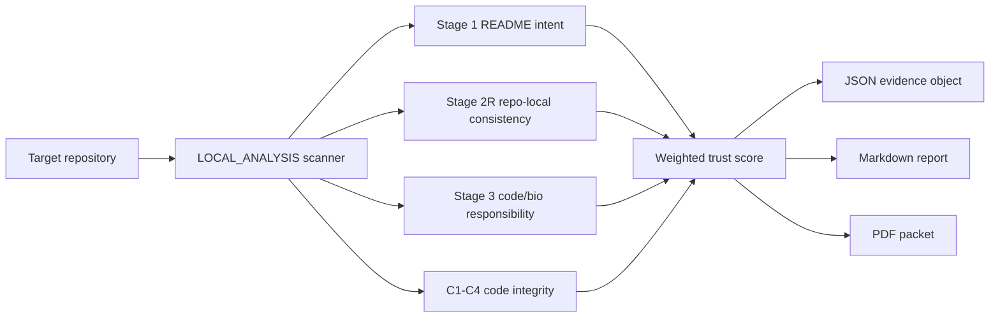

# STEM-AI

**Sovereign Trust Evaluator for Medical AI Artifacts**

[](https://github.com/flamehaven01/STEM-AI-BIO/actions/workflows/python-package.yml)
[](https://github.com/flamehaven01/STEM-AI-BIO/actions/workflows/validate-skill.yml)
[](pyproject.toml)
[](LICENSE)
[](CHANGELOG.md)
[](#installation)

STEM-AI is a deterministic trust-audit framework for open-source bio/medical AI repositories. It inspects repository artifacts, scores observable governance evidence, and emits machine-readable JSON, Markdown, and PDF review packets.

It is not a clinical certifier, regulatory clearance tool, or scientific efficacy validator. It answers a narrower question:

> Does this repository expose enough trust evidence to be considered, contained, or rejected?

```text
stem <folder>                    # Level 1: 1-page executive brief
stem <folder> --level 2          # Level 2: 3-page stage analysis
stem <folder> --level 3          # Level 3: 5-page full review packet
```

## Table of Contents

- [About](#about)
- [Features](#features)
- [Screenshots and Outputs](#screenshots-and-outputs)
- [Quick Start](#quick-start)
- [Installation](#installation)
- [CLI Usage](#cli-usage)
- [Web Demo](#web-demo)
- [Architecture](#architecture)
- [Scoring Model](#scoring-model)
- [Repository Structure](#repository-structure)
- [Configuration](#configuration)
- [Security and Boundaries](#security-and-boundaries)
- [Roadmap](#roadmap)
- [Contributing](#contributing)
- [License](#license)
- [Citation](#citation)

## About

Bio/medical AI repositories often look credible at the README layer while leaving important trust gaps in code, CI, dependency hygiene, or clinical-use boundaries. STEM-AI evaluates the visible repository surface instead of relying on marketing claims.

The framework separates two jobs:

- **Fact extraction:** inspect README, docs, package metadata, tests, CI, dependency files, and code paths.
- **Trust classification:** score whether the observable evidence supports supervised use, quarantine, or rejection.

STEM-AI v1.1.2 adds the MICA memory contract layer: immutable invariants, a session playbook, prior failure lessons, and a pre-execution contract test for reducing auditor drift.

## Features

- **Zero-API local CLI:** run deterministic LOCAL_ANALYSIS without an LLM key.
- **Three report levels:** 1-page brief, 3-page standard review, or 5-page deep review.
- **Multi-format output:** JSON for machines, Markdown for review, PDF for human briefings.
- **Stage 2R repo-local consistency:** scores README/docs/package/workflow/test alignment when external cross-platform evidence is not collected.
- **Code integrity checks:** C1-C4 checks for credentials, dependency pinning, deprecated patient-adjacent paths, and fail-open exception handling.
- **Clinical-adjacency classification:** detects patient-adjacent language and clinical boundary evidence.
- **MICA contract artifacts:** memory, playbook, lessons archive, and protocol files are versioned in the repository.
- **Universal agent skill:** usable as a local skill for Codex, Claude Code, Gemini CLI, Cursor, and related agent environments.

## Screenshots and Outputs

Typical LOCAL_ANALYSIS output includes:

- `*_experiment_results.json` -- machine-readable score and evidence object.
- `*_report.md` -- human-readable audit report.
- `*_brief_1p.pdf` -- executive dashboard.
- `*_detailed_3p.pdf` -- stage breakdown and gap analysis.
- `*_detailed_5p.pdf` -- deep integrity review, roadmap, and metadata.

The official v1.1.2 example artifact shape is stored under:

```text
audits/fieldbioinformatics_v1_1_2/
```

## Quick Start

Clone the repository and install the local CLI:

```bash
git clone https://github.com/flamehaven01/STEM-AI-BIO.git
cd STEM-AI-BIO
pip install -e .[pdf]
```

Run a default Level 1 audit:

```bash
stem /path/to/bio-ai-repo
```

Run the full Level 3 packet:

```bash
stem /path/to/bio-ai-repo --level 3 --format all --out stem_output
```

## Installation

### Python CLI

```bash
pip install -e .[pdf]
```

PyPI distribution is intentionally not advertised yet. The `stem-ai` package name was checked before adding badges, and no live PyPI release is currently assumed by this README.

### Universal Agent Skill

```bash
git clone --branch v1.1.2 --depth 1 https://github.com/flamehaven01/STEM-AI-BIO.git ~/.agents/skills/stem-ai
```

Claude Code path:

```bash
git clone --branch v1.1.2 --depth 1 https://github.com/flamehaven01/STEM-AI-BIO.git ~/.claude/skills/stem-ai
```

Project-local path:

```bash
mkdir -p .agents/skills
git clone https://github.com/flamehaven01/STEM-AI-BIO.git .agents/skills/stem-ai
```

## CLI Usage

```bash
stem <folder> [--level 1|2|3] [--format json|md|pdf|all] [--out stem_output]
```

| Command | Output |
|---|---|
| `stem <folder>` | Level 1 brief, 1-page PDF by default |
| `stem <folder> --level 2` | Level 2 standard, 3-page PDF |
| `stem <folder> --level 3` | Level 3 full, 5-page PDF |
| `stem <folder> --format json` | JSON evidence object only |
| `stem <folder> --format all` | JSON, Markdown, and PDF |

The shortcut form `stem <folder>` is equivalent to `stem audit <folder>`. GitHub URL auditing is not enabled in the local CLI yet; clone the target repository first.

## Web Demo

The Hugging Face / Gradio entry point is:

```text
app.py
```

Run locally:

```bash
pip install -e .[demo]
python app.py
```

The demo accepts a public GitHub URL, clones it into a temporary directory, runs the deterministic local scanner, and returns Markdown, JSON, and PDF outputs.

## Architecture



MICA artifacts live in `memory/` and `spec/`:

- `memory/stem-ai.mica.v1.1.2.json`
- `memory/stem-ai-playbook.v1.1.2.md`
- `memory/stem-ai-lessons.v1.1.2.md`
- `spec/STEM-AI_v1.1.2_CORE.md`
- `spec/CONSISTENCY_PROTOCOL.md`

## Scoring Model

| Layer | Weight | What It Evaluates |
|---|---:|---|
| Stage 1: README Intent | 40% | Scope clarity, hype control, clinical boundary language |
| Stage 2R: Repo-Local Consistency | 20% | README/docs/package/workflow/test alignment |
| Stage 3: Code / Bio Responsibility | 40% | CI, tests, changelog hygiene, data provenance, governance maturity |
| C1-C4: Code Integrity | Advisory / penalty | Credentials, dependency pinning, deprecated patient-adjacent paths, exception behavior |

Tier boundaries:

| Tier | Score | Meaning |
|---|---:|---|
| T0 | 0-39 | Trust not established |
| T1 | 40-54 | Quarantine |
| T2 | 55-69 | Caution |
| T3 | 70-84 | Consider |
| T4 | 85-100 | Strong observable trust |

## Repository Structure

```text
stem-ai/
  SKILL.md                    # Universal agent skill entry point
  README.md                   # Project overview and usage
  pyproject.toml              # Python package metadata
  app.py                      # Hugging Face / Gradio entry point
  CHANGELOG.md                # Version history
  CONTRIBUTING.md             # Contribution guidelines
  .github/workflows/          # CI checks
  audits/                     # Versioned audit artifacts
  discrimination/             # Rubric discrimination examples
  memory/                     # MICA contract artifacts
  references/                 # Tier and taxonomy references
  scripts/                    # Local validation scripts
  spec/                       # Core protocol specifications
  stem_ai/                    # Python CLI, scanner, renderer
  templates/                  # Report templates
```

## Configuration

No API key is required for the deterministic local CLI.

Optional extras:

| Extra | Purpose |
|---|---|
| `.[pdf]` | Installs `reportlab` for PDF rendering |
| `.[demo]` | Installs `gradio` and PDF support for the web demo |

Recommended local verification:

```bash
python -m py_compile stem_ai/cli.py stem_ai/scanner.py stem_ai/render.py stem_ai/app.py
stem /path/to/bio-ai-repo --level 3 --format all --out stem_output
```

## Security and Boundaries

- STEM-AI does not certify clinical safety.
- STEM-AI does not validate scientific efficacy.
- STEM-AI does not replace regulatory, legal, security, or medical review.
- The local CLI analyzes repository artifacts and does not require uploading code to an external LLM.
- Public demo usage should be limited to public repositories. Private audits should run locally or inside the owner-controlled environment.

## Roadmap

- Publish a PyPI package only after CLI and PDF outputs stabilize.
- Add runtime replay lanes for dependency-aware execution checks.
- Add deterministic snapshot fixtures for multi-run reproducibility testing.
- Expand CI to include golden JSON/PDF artifact checks.
- Improve Hugging Face demo ergonomics without weakening local-first behavior.

## Version History

| Version | Key Changes |
|---|---|
| 1.0.0 | Initial 3-stage concept |
| 1.0.6 | LOCAL_ANALYSIS, dual-path rubric, CA 3-tier, C1-C4 |
| 1.1.0 | Universal skill package and institutional templates |
| 1.1.1 | Canonical version alignment and audit-layer separation |
| 1.1.2 | MICA memory layer plus official LOCAL_ANALYSIS artifact shape |

See [CHANGELOG.md](CHANGELOG.md) for full details.

## Contributing

See [CONTRIBUTING.md](CONTRIBUTING.md) for contribution guidelines.

Useful contribution areas:

- New rubric discrimination examples from real audits.
- Clinical-adjacency trigger refinements.
- Report rendering improvements.
- CI and reproducibility checks.
- Documentation clarity around method boundaries.

## License

Apache 2.0. See [LICENSE](LICENSE).

## Acknowledgements

STEM-AI was shaped by live audits of open-source bioinformatics and bio/medical AI repositories, with emphasis on observable evidence rather than claims.

## Author

Maintained by Flamehaven.

- GitHub: [flamehaven01](https://github.com/flamehaven01)
- Website: [flamehaven.space](https://flamehaven.space)

## Citation

```bibtex
@software{stem-ai,
  author = {Yun, Kwansub},
  title = {STEM-AI: Sovereign Trust Evaluator for Medical AI Artifacts},
  version = {1.1.2},
  year = {2026},
  url = {https://github.com/flamehaven01/STEM-AI-BIO}
}
```

---

Final thought: STEM-AI is designed to be a governance layer, not a verdict machine. Its role is to make bio/medical AI review more reproducible, inspectable, and bounded by evidence paths.
